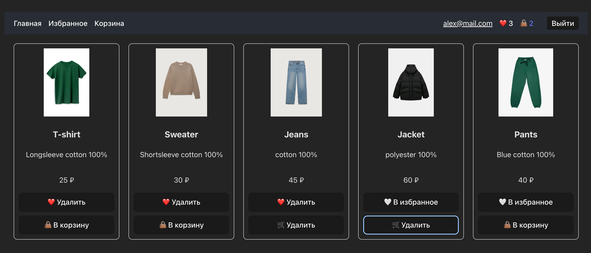
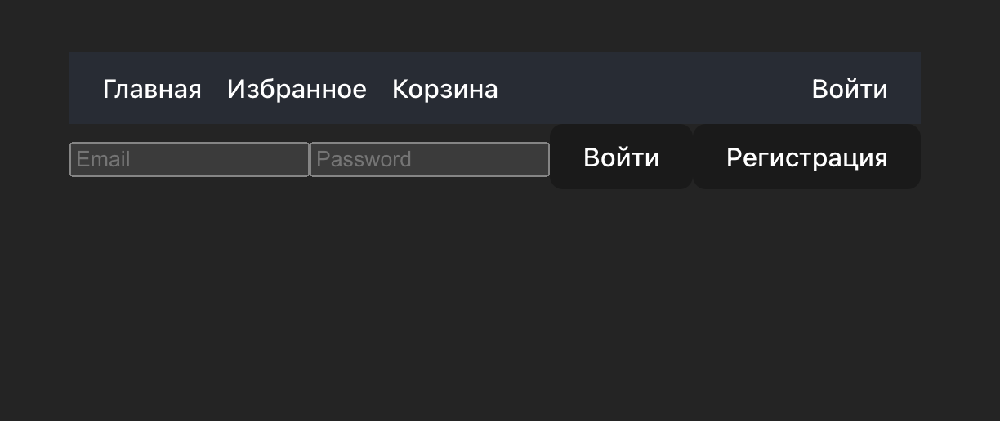
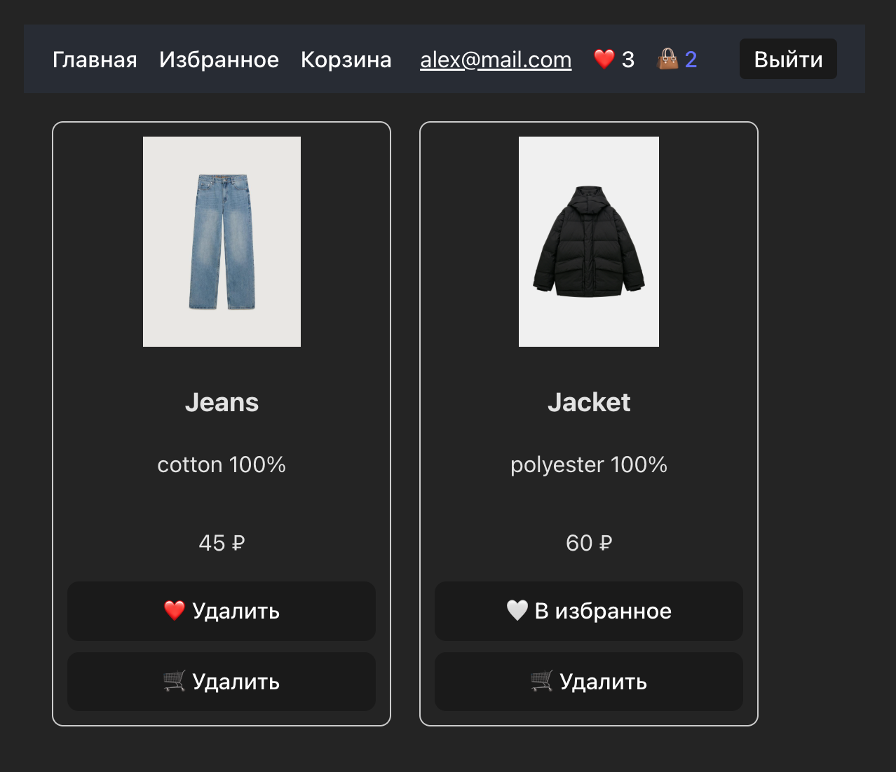
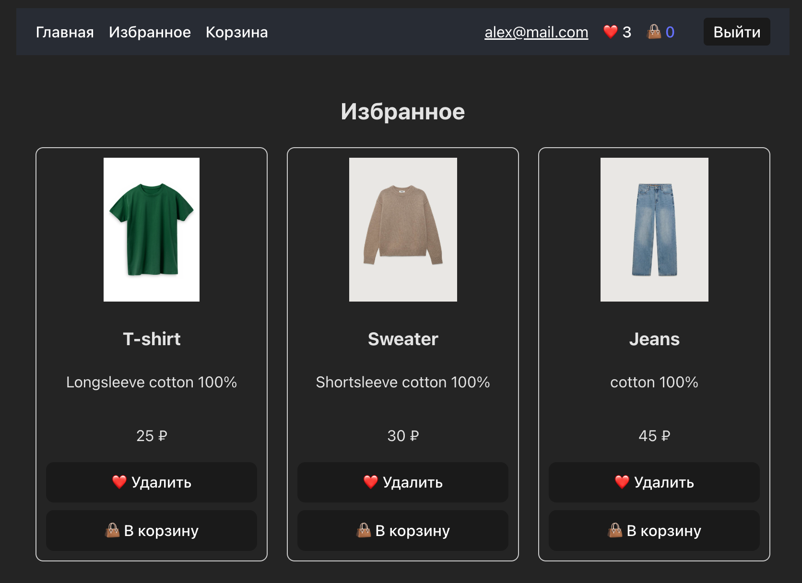
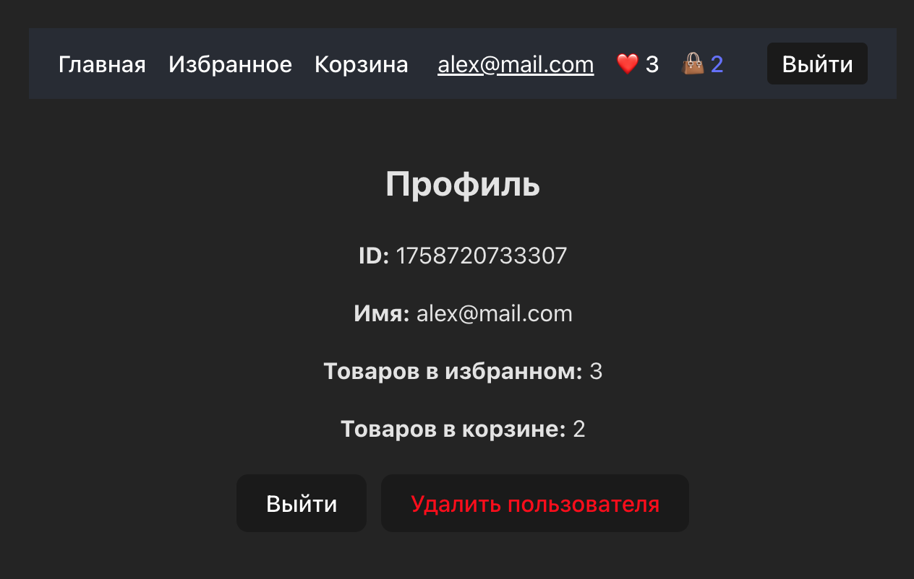

### Скрины приложения







---

## 📌 Сценарий

пишем MVP — простое приложение - интернет магазин.
Там будут:

* авторизация,
* сохранение данных локально,
* несколько страниц (Login, Dashboard, Cards, Cart, Favorites).

---


## 🔹 Первая неделя (онбординг)

**Твоя задача:**

1. Поднять проект на **React + TypeScript** (через Vite).
2. Настроить базовую структуру проекта (папки `components`, `pages`, `api`, `hooks`).
3. Сделать пустую заглушку для приложения:

   * `App.tsx` → выводит “Hello Task Manager”.
   * `pages/Login.tsx` → выводит “Login Page”.
   * `pages/Dashboard.tsx` → выводит “Dashboard Page”.
   * Подключить React Router: по `/` открывается Login, по `/dashboard` → Dashboard.

👉 Пока без авторизации, просто чтобы были роуты и страницы.

---
---


* Поднял проект на React + TS.
* Настроил структуру.
* Подключил роутер и сделал две страницы.
* Справился без прямых решений, а только с подсказками — это топ для джуна.

⚠️ На что обратить внимание:

* Следи за чистотой импортов (чтобы не было лишнего).
* Лучше сразу вынести страницы в папку `pages/` и давать им осмысленные названия (`Login.tsx`, `Dashboard.tsx`).
* Для читаемости — сделай в `App.tsx` простой `Routes` и убедись, что всё рендерится.

---


## 🔹 Следующая задача

Добавим немного практики со **стейтом и формой**.
**Задача №2:**

* На странице **Login** сделай простую форму:

  * input для email,
  * input для password,
  * кнопка "Войти".
* При нажатии на кнопку выводи в консоль введённые данные.
* Используй **`useState`** для управления значениями.

👉 Это пока будет фейковая авторизация (никаких API, просто controlled inputs).

---

---

### ✅ Что ты сделал правильно

* Поднял controlled inputs через `useState` — это must-have практика для форм.
* Сделал сабмит и вывод в консоль — хороший способ проверить, что данные реально живые.
* Скорее всего, вынес форму на отдельную страницу (`Login`) — это структурно верное решение.

---

### ⚠️ На что обратить внимание

1. **Обработка сабмита:**
   Обычно в React форма оборачивается в тег `<form onSubmit={handleSubmit}>`.
   И в `handleSubmit` мы делаем `event.preventDefault()`, чтобы страница не перезагружалась.
   Если ты сделал сабмит через `onClick` на кнопке — это тоже норм, но лучше привыкать к `<form>`.

2. **Типизация:**
   Так как у тебя TypeScript, полезно сразу типизировать `useState`:

   ```ts
   const [email, setEmail] = useState<string>("");
   const [password, setPassword] = useState<string>("");
   ```

   Это простая привычка, которая помогает на проектах.

3. **Структура:**
   Если у тебя сейчас всё в `Login.tsx`, то окей. Но дальше форму мы можем вынести в отдельный компонент (`LoginForm.tsx`) внутри `components/`.

---


## 🔹 Следующая задача

Теперь мы добавляем чуть-чуть "реализма":

* После сабмита формы делай редирект на `/dashboard`.
* Чтобы "симулировать" авторизацию, сохраняй данные пользователя в `localStorage`.

  * Например, `{ email: "...", token: "fake_token" }`.
* На странице `Dashboard` выводи `Добро пожаловать, email`.

---

## 📌 Анализ твоей предыдущей задачи

### ✅ Что сделано хорошо

1. **Использование `useState` и controlled inputs**

   * Все данные формы живые, изменяются при вводе — правильно для React.

2. **Типизация с TypeScript**

   * `useState<string>` для email/password
   * `handleSubmit` с типом `React.FormEvent<HTMLFormElement>`
     → Это правильная практика, которая убирает любые «any» и ошибки типов.

3. **Сохранение в `localStorage`**

   * Данные пользователя сохраняются после сабмита.
   * Ты понял, что нужно использовать `JSON.stringify` для объекта.

4. **Редирект с `useNavigate`**

   * После сабмита происходит переход на `/dashboard`.
   * Все работает корректно, без перезагрузки страницы.

5. **Dashboard получает данные из `localStorage`**

   * Проверка на наличие email → редирект на Login, если пользователь не найден.
   * Отображение `Добро пожаловать, email` — работает.

6. **Структура компонентов**

   * Login и Dashboard — отдельные страницы.
   * Используется React Router, чистый и понятный роутинг.


### ✅ Вывод

Ты полностью справился с задачей, освоил:

* React Router
* useState + controlled inputs
* TypeScript типизацию событий
* localStorage
* редирект с useNavigate

---


### 🚀 Задача: Реализовать кнопку **«Выйти»** (Logout)

#### 📌 Условия:

1. Кнопка должна быть на странице **Dashboard**.
2. При клике:

   * удаляется пользователь из `localStorage`

     ```ts
     localStorage.removeItem("user");
     ```
   * делается редирект обратно на `/` (страницу Login)

---


### 🚀 Задача: Теперь мы делаем **полноценный фейковый аутентификационный flow** с регистрацией и входом. 

Давай разобьём задачу на **шаги**, чтобы было понятно, что делать:

---

## 📌 Шаг 1: Структура хранения пользователей в localStorage

* Сейчас у тебя хранится один пользователь:

```ts
localStorage.setItem("user", JSON.stringify({ email, token: "fake_token" }));
```

* Теперь будем хранить **несколько пользователей**.
* Ключ для каждого пользователя:

```ts
const userKey = email.split('@')[0]; // всё до символа '@'
```

* В localStorage будет так:

```ts
localStorage.setItem(userKey, JSON.stringify({ email, token: "fake_token" }));
```

💡 Пример:

* Email: `alex@mail.com` → ключ: `alex`
* Email: `maria@gmail.com` → ключ: `maria`

---

## 📌 Шаг 2: Форма регистрации

1. Добавляем кнопку **Регистрация** на Login странице.
2. При нажатии:

   * Проверяем, нет ли уже пользователя с таким ключом.
   * Если нет → сохраняем в localStorage под ключом и делаем редирект на '\dashboard'.
   * Если есть → alert «Пользователь уже существует» .

---

## 📌 Шаг 3: Форма входа

1. При нажатии **Войти**:

   * Берём введённый email → ключ = email.
   * Проверяем localStorage:

     ```ts
     const storedUser = localStorage.getItem(userKey);
     ```
   * Если данные есть и пароль совпадает → редирект на Dashboard
   * Иначе → alert «Неверный логин или пароль»

---

## 📌 Шаг 4: Поддержка Dashboard

* Dashboard остаётся такой же:

  * берёт данные пользователя через ключ (можно хранить ключ в localStorage как `currentUser` для сессии).

💡 Совет:

* При логине записывай ещё один ключ `currentUser = userKey` → Dashboard читает текущего пользователя.
* Это позволяет работать с несколькими пользователями.

---

Отлично, джун! 🔥 Давай подведём итог твоей работы над модулем авторизации и регистрации.

---

## 📌 Итоговый анализ твоего MVP (Login + Dashboard)

### ✅ Что реализовано и работает

1. **Регистрация**

   * Меняем ключ с `email.split('@')[0]` на email → ключ = `email`.
   * Пользователь вводит email и пароль → сохраняется в localStorage под ключом полного email.
   * После регистрации автоматически создаётся сессия (`currentUser`) → редирект на Dashboard.
   * Проверка на существующего пользователя → alert при дублировании.

2. **Вход**

   * Проверка email и пароля по данным в localStorage.
   * При успешном входе создаётся сессия (`currentUser`) → редирект на Dashboard.
   * Неверные данные → alert «Неверный логин или пароль».

3. **Dashboard**

   * Получение текущего пользователя через `currentUser`.
   * Защита страницы: если пользователь не авторизован → редирект на Login.
   * Кнопка **Выйти** → завершение сессии без удаления данных.
   * Кнопка **Удалить учетную запись** → полностью удаляет данные пользователя + сессию.

4. **Типизация TypeScript**

   * useState для email/password
   * События форм и кнопок типизированы (`React.FormEvent`, `React.MouseEvent`)
   * Нет ошибок TS, всё строго.

5. **Логика localStorage**

   * Полный email → уникальный ключ
   * Сессия через отдельный ключ `currentUser`
   * Возможность хранить нескольких пользователей

6. **Редиректы**

   * После регистрации и входа → Dashboard
   * После Logout/удаления аккаунта → Login

---

### ✅ Вывод

Ты сделал **полноценную систему регистрации и входа** для MVP на React + TypeScript:

* Несколько пользователей
* Сессия через `currentUser`
* Защита страниц
* Logout и удаление аккаунта
* Полная работа с localStorage

---

### Задача создать тестовый Интернет магазин:
 - Главная (каталог) → карточки товаров, у каждой кнопки "В корзину" и "В избранное".
 - Хедер → навигация (Главная, Корзина, Избранное, Авторизация).
 - Авторизация/Регистрация → вынесены в отдельный блок в хедере.
 - Карточки → состояние должно хранить данные о корзине и избранном.

# Обновлённая структура

```
src/
 ┣ components/
 ┃ ┣ Header.tsx          # навигация + блок авторизации (ссылка/кнопка на Login или профиль)
 ┃ ┣ Card.tsx
 ┃ ┗ CardList.tsx
 ┣ pages/
 ┃ ┣ Home.tsx            # каталог (рендер CardList из data)
 ┃ ┣ Favorites.tsx       # избранное
 ┃ ┣ Cart.tsx            # корзина
 ┃ ┣ Login.tsx           # страница входа (мы её делали ранее)
 ┃ ┗ Dashboard.tsx       # кабинет пользователя
 ┣ data/
 ┃ ┗ products.ts         # export const Data = [...]
 ┣ routes/
 ┃ ┗ AppRoutes.tsx       # все Route'ы
 ┣ App.tsx
 ┣ main.tsx
```

# Короткие примечания

* `Header` — показывает ссылки: **Главная (/), Корзина (/cart), Избранное (/favorites), Войти (/login)**; если `currentUser` есть — показывает ссылку на **Dashboard (/dashboard)** и кнопку выхода.
* `Login.tsx` — остаётся как отдельная страница (там логика login/register, установка `currentUser`).
* `AppRoutes.tsx` — маршруты, например:
  `/` → `Home`, `/cart` → `Cart`, `/favorites` → `Favorites`, `/login` → `Login`, `/dashboard` → `Dashboard`.
* `products.ts` — твой массив `Data` с товарами; `CardList` импортирует `Data` и рендерит `Card` для каждого item.

---

Апдейт по изменениям:
### 🔹 1. Изменение концепции

Ты решил уйти от локальных задач и переключиться на **каталог интернет-магазина** с карточками товаров. Это правильный шаг — проект сразу становится ближе к реальной практике (корзина, избранное, авторизация, роутинг).

👉 Плюсы:

* Ближе к реальным бизнес-кейсам.
* Можно отрабатывать работу с данными, структурой проекта и маршрутизацией.
* Хорошая база для подключения бэкенда в будущем.

---

### 🔹 2. Архитектура и структура проекта

Ты добавил:

* **Header** с навигацией (Главная, Корзина, Избранное, Авторизация).
* **AppRoutes** с прописанными путями (`Home`, `Cart`, `Favorites`, `Authorisation`, `Dashboard`).
* **Папку types** для типизации приложения.
* **Папку data** для хранения массива товаров.

👉 Это грамотное решение, потому что:

* У тебя теперь **чёткое разделение** между страницами и компонентами.
* Ты избежал дублирования — данные выносятся отдельно и импортируются в компоненты.
* Типизация вынесена в `types.ts`, что повышает читаемость.

---

### 🔹 3. Авторизация

Ты оставил уже реализованную часть (Login + Dashboard), встроил её в **Authorisation**, сохранив базовую логику:

* Регистрация сохраняет пользователя в `localStorage`.
* Вход сверяет данные и редиректит на Dashboard.
* В Dashboard можно выйти и удалить аккаунт.

👉 Плюсы:

* Авторизация встроена в навигацию через Header.
* Минимальная рабочая модель сохранения данных готова.
* Уже реализован выход и удаление учётной записи.

---

### 🔹 4. Карточки товаров

Ты создал `CardList`, где происходит **map по массиву данных** и рендерится `Card`.

* В `Card` у тебя: картинка, название, описание, цена, кнопки «В корзину» и «В избранное».
* Добавил типизацию пропсов.

👉 Доработки:

* Исправили баг с `img` vs `image`.
* Навели стилизацию (фиксированная высота, одинаковое выравнивание элементов).
* Карточки получили базовый дизайн и стали аккуратными.

---

### 🔹 5. Визуальная часть

* Header всегда закреплён сверху.
* Страницы переключаются через `Link`.
* Карточки приведены к одинаковому виду (фиксированная высота, кнопки прижаты вниз).

👉 Плюсы:

* Навигация понятная.
* Карточки выглядят аккуратно и симметрично.
* Приложение стало похоже на реальный интернет-магазин.

---

## 📊 Итоговый анализ

Ты сделал **большой шаг вперёд**:

* Разбил проект на страницы, компоненты и данные.
* Добавил авторизацию, личный кабинет, корзину и избранное (пути уже есть, логика будет позже).
* Навёл порядок в типизации и структуре файлов.
* Решил проблему с отображением карточек и их визуальной симметрией.

---


### ПЛАНЫ Далее: 
- данные из JSON (иммитация сервака) - готово
- логика добвления и удаления в/из избранного с привязкой к зарегестрированному пользователю, кнопка должна быть доступна только после авторизации - готово

### Итони работы: 
Отлично, теперь у меня есть полная картина проекта. Давай резюмируем, на чем мы остановились и как это устроено:

---

### **Структура и логика**

1. **Типы (`types.ts`)**

   * `IProduct` — продукт с `id, img, name, description, price`.
   * `IUser` — пользователь с `id, name, favorites, cart`.
   * `IAuthContext` — контекст авторизации с `user` и методами `login`, `logout`, `toggleFavorite`, `toggleCart`.

2. **Контекст авторизации**

   * `AuthContextInstance.ts` — создаёт контекст:

     ```ts
     export const AuthContext = createContext<IAuthContext | undefined>(undefined);
     ```
   * `AuthProvider.tsx` — компонент-провайдер, который хранит состояние `user` и реализует методы изменения:

     * `login(name: string)` — логин.
     * `logout()` — разлогин.
     * `toggleFavorite(productId: number)` — добавление/удаление из избранного.
     * `toggleCart(productId: number)` — добавление/удаление из корзины.

3. **Хук `useAuth`**

   * Вынесен отдельно в `hooks/useAuth.ts`:

     ```ts
     import { useContext } from "react";
     import { AuthContext } from "../context/AuthContextInstance";

     const useAuth = () => {
       const ctx = useContext(AuthContext);
       if (!ctx) throw new Error("useAuth должен использоваться внутри AuthProvider");
       return ctx;
     };

     export default useAuth;
     ```
   * Позволяет любому компоненту получить доступ к `user` и методам контекста.

4. **Компоненты**

   * `Card.tsx` — карточка товара:

     * Получает объект `IProduct`.
     * Состояние пользователя (`user`) через `useAuth`.
     * Кнопки: "В корзину" и "В избранное", доступны только после авторизации.
     * Стиль фиксированного размера, чтобы карточки не растягивались.

   * `CardList.tsx` — список карточек:

     * Загружает продукты через `fetch("/products.json")`.
     * Управляет состояниями `loading`, `error`.
     * Мапит продукты в `Card`.

   * `Header.tsx` — навигация между страницами через `react-router-dom`.

5. **Страница авторизации (`Login.tsx`)**

   * Использует локальное хранилище для имитации сервера.
   * После успешного входа/регистрации вызывает `login(email)` из контекста, чтобы обновить состояние в приложении.

6. **App.tsx**

   * Оборачивает всё приложение в `BrowserRouter` и `AuthProvider`:

     ```tsx
     <BrowserRouter>
       <AuthProvider>
         <Header />
         <AppRoutes />
       </AuthProvider>
     </BrowserRouter>
     ```
   * Обеспечивает доступ к роутам и авторизации по всему приложению.

---

### **Что мы сделали правильно**

* Разделили контекст и хук: ESLint больше не ругается на Fast Refresh.
* `Card` использует напрямую `IProduct`, не нужно создавать отдельный `CardProps`.
* Реализована логика SPA: авторизация влияет на кнопки "В корзину" и "В избранное".
* Карточки фиксированного размера, чтобы не растягивались.

---

### **Что можно улучшить дальше**

1. **Состояние авторизации между сессиями**

   * Сейчас `useAuth` хранит `user` только в памяти.
   * Можно при загрузке приложения проверять `localStorage.getItem("currentUser")` и подгружать пользователя автоматически.

2. **Стили**

   * Сейчас inline-стили. Можно вынести в CSS/SCSS или использовать `styled-components` для масштабируемости.

3. **Кнопки "В корзину" и "В избранное"**

   * Сейчас полностью перерендериваются при каждом клике. Можно оптимизировать, чтобы не перерисовывать весь список карточек.

4. **Карточки**

   * Сейчас `CardList` использует `flex` без обертки в `wrap`, при большом количестве товаров они будут выходить за экран.

---


### Итого сделано: 

- добавление состояния авторизации в хедер - готово
- компонент Корзина
- компонент Избранное
- привязка корзины и избранного к авторизированному пользователю через localstorage


Общий вывод по этапу:

1. **Добавление страниц и компонентов**

* **`FavoritePage` и `CartPage`**

  * Созданы новые страницы для отображения товаров в избранном и в корзине.
  * Каждая страница рендерит список карточек (`Favorites` или `CartList`) с фильтрацией по текущему пользователю.
  * Логика фильтрации идёт через `user.favorites` и `user.cart`.

* **Компоненты `Favorites` и `CartList`**

  * Принимают список всех продуктов (`products.json`) и отбирают только те, что добавлены пользователем.
  * Отображают карточки аналогично `CardList`, но с ограничением по состоянию пользователя.

**Вывод:** добавлены **фильтрованные списки**, которые корректно отображают текущие данные пользователя.

---

## 2. **Сохранение состояния по пользователю**

* **Контекст `AuthContext`**

  * В `user` добавлены поля `favorites` и `cart`.
  * Методы `toggleFavorite` и `toggleCart` обновляют эти поля через `setUser`.
* **LocalStorage**

  * При входе/регистрации пользователя вызывается `login(email)`.
  * После этого состояние пользователя сохраняется и синхронизируется с `localStorage` (через ключ `currentUser`).
  * Таким образом, даже после выхода или перезагрузки состояние корзины и избранного остаётся привязанным к пользователю.

**Вывод:** состояние теперь **пользователь-зависимое**, сохраняется между сессиями.

---

## 3. **Обновление интерфейса**

* **Хедер (`Header.tsx`)**

  * Сердечко ❤️ и корзина 🛒 теперь кликабельны и ведут на страницы избранного и корзины.
  * Отображаются количество товаров в избранном и корзине.
  * Центровка и отступы настроены, чтобы элементы не жались друг к другу.
  * Имя пользователя кликабельно и ведёт на страницу профиля.

* **Карточки (`Card.tsx`)**

  * Кнопки «в избранное» и «в корзину» заменены на иконки.
  * Иконки меняют состояние при клике, и контекст обновляется в реальном времени.
  * В карточках используются текущие значения пользователя (`favorites` и `cart`).

**Вывод:** UI стал **интерактивным**, элементы реагируют на действия пользователя мгновенно, визуально понятно.

---

## 4. **SPA-подход и маршрутизация**

* Страницы `/favorites` и `/cart` доступны только через хедер (клики по ❤️ и 🛒).
* Используется `react-router-dom` с `Link` и `useNavigate`.
* Нет перезагрузок страницы, весь функционал работает в **SPA-режиме**.

**Вывод:** пользователь может **свободно переходить между страницами**, сохраняя состояние корзины и избранного.

---

## 5. **Общий результат**

1. **Состояние пользователя** теперь полноценное: содержит корзину и избранное.
2. **Списки товаров** фильтруются по пользователю.
3. **UI** стал интерактивным и информативным: отображается количество товаров, иконки вместо текста.
4. **Сохранение данных** через `localStorage` позволяет сохранять состояние между сессиями.
5. **Маршрутизация и хедер** полностью интегрированы с новым функционалом.

---

Если кратко: добавлен полноценный **модуль избранного и корзины**, который зависит от авторизации, синхронизирован с контекстом и `localStorage`, и всё это работает в SPA, с интерактивными карточками и хедером.

---


### Итого сделано: 

- карточка конкретного товара, на которую можно перейти по клику карточки с главной
- добавлена кнопка выйти в хедер (теперь кнопки сменяются войти/выйти по статусу авторизации пользователя)
- мелкие улучшения

Итоги сделанного коммита:

### 1️⃣ **Карточки товаров (Card.tsx)**

**Что изменили:**

* Сделали кнопки "В избранное" и "В корзину" с использованием иконок вместо текста:

  * Избранное: ❤️ / 🤍
  * Корзина: 🛒 / "Удалить из корзины"
* Кнопки теперь используют состояния пользователя (`user.favorites` и `user.cart`) для динамического отображения.
* Обернули кнопки в `<div>` с `flex-direction: column` для аккуратного отображения.
* Сделан клик по карточке (по картинке, имени, описанию) для перехода на страницу `ProductPage` по `id`, но исключая область кнопок.

**Итог:**

* UI стал компактнее и визуально понятнее.
* Навигация по карточкам стала интуитивной.
* Состояние корзины и избранного стало управляться через контекст, а не локально в компоненте.

---

### 2️⃣ **Контекст авторизации (AuthContext)**

**Что изменили:**

* Добавили поле `cart` в интерфейс пользователя (`IUser`) и методы `toggleCart` для управления корзиной.
* Вынесли хук `useAuth` в отдельный файл `hooks/useAuth.ts` для корректной работы Fast Refresh и переиспользуемости.
* Методы контекста теперь:

  * `login(name: string)`
  * `logout()`
  * `toggleFavorite(productId: number)`
  * `toggleCart(productId: number)`

**Итог:**

* Контекст полностью централизует состояние авторизации, избранного и корзины.
* Все компоненты стали использовать единый источник данных, что упрощает логику и синхронизацию состояний.

---

### 3️⃣ **Header.tsx**

**Что изменили:**

* Добавили отображение имени пользователя при авторизации.
* Сделали счетчики для избранного (❤️) и корзины (👜) кликабельными с переходом на соответствующие страницы.
* Добавили кнопку **Выйти** справа от корзины:

  * Видна только при авторизации.
  * Вызывает метод `logout`.
* Сделана аккуратная верстка с `flex`, `gap` и `marginLeft` для правильных отступов между элементами.
* Профиль, корзина и избранное теперь имеют единый стиль и центрированы по вертикали.

**Итог:**

* Header стал более функциональным и информативным.
* Пользователь всегда видит свое имя, количество товаров в избранном и корзине, а также имеет доступ к кнопке выхода.
* Переходы по страницам (профиль, избранное, корзина) стали интуитивными.

---

### 4️⃣ **Навигация и страницы**

**Что изменили:**

* Добавлены страницы:

  * `FavoritesPage` с компонентом `Favorites`
  * `CartPage` с компонентом `CartList`
* Переходы к страницам избранного и корзины настроены через Header и ссылки на карточках.
* Логика отображения данных на этих страницах использует данные из контекста (`user.favorites` и `user.cart`).

**Итог:**

* Появились полноценные страницы для работы с избранным и корзиной.
* Состояние элементов хранится в контексте и синхронизируется с UI без перезагрузки страницы.

---

### 5️⃣ **Общие улучшения**

* Убраны `CardProps` — используем напрямую интерфейс `IProduct` из типов.
* Сделано более безопасное управление состоянием с проверкой авторизации (`user ? ... : ...`).
* Fast Refresh больше не ругается из-за хука и контекста (они вынесены в отдельные файлы).

---

### 🔹 **Выводы**

* **UX/UI:** интерфейс стал удобнее, кнопки с иконками и счетчики товаров упрощают взаимодействие.
* **Архитектура:** контекст авторизации стал централизованным хранилищем состояния пользователя, избранного и корзины.
* **Навигация:** клики по карточкам, избранному и корзине теперь корректно работают, переход на страницы настроен.
* **Поддерживаемость:** структура компонентов и хуков стала более модульной, легче добавлять новые функции (например, редирект на страницу продукта, сохранение на сервер и т.д.).

---
---

## **Структура приложения (после всех изменений)**

```
App.tsx
│
├─ BrowserRouter
│   │
│   ├─ AuthProvider  ← Контекст авторизации (user, favorites, cart)
│   │   │
│   │   ├─ Header.tsx  ← Навигация + отображение пользователя, избранного и корзины
│   │   │   ├─ Link: Главная → CardList
│   │   │   ├─ Link: Избранное → FavoritesPage
│   │   │   ├─ Link: Корзина → CartPage
│   │   │   └─ Имя пользователя + Выйти
│   │   │
│   │   └─ AppRoutes.tsx  ← Роуты страниц
│   │       ├─ "/" → CardList.tsx
│   │       │   └─ Card.tsx  ← отображение каждой карточки
│   │       │       ├─ Картинка/Имя/Описание → navigate(`/product/${id}`)
│   │       │       ├─ ❤️ Избранное → toggleFavorite(id)
│   │       │       └─ 🛒 Корзина → toggleCart(id)
│   │       │
│   │       ├─ "/product/:id" → ProductPage.tsx
│   │       │   └─ CardInfo.tsx  ← подробная информация о товаре
│   │       │
│   │       ├─ "/favorites" → FavoritesPage.tsx
│   │       │   └─ Favorites.tsx  ← список товаров из user.favorites
│   │       │
│   │       ├─ "/cart" → CartPage.tsx
│   │       │   └─ CartList.tsx  ← список товаров из user.cart
│   │       │
│   │       ├─ "/login" → Login.tsx
│   │       │   └─ форма логина/регистрации, вызывает login() из контекста
│   │       │
│   │       └─ "/profile" → ProfilePage.tsx
│   │           └─ информация о пользователе + кнопки "Выйти" / "Удалить"
│   │
│   └─ Другие глобальные компоненты (по необходимости)
│
└─ public/products.json  ← данные о товарах для CardList
```

---

### **Связи и потоки данных**

1. **Контекст AuthProvider**

   * Хранит состояние:

     * `user` (id, name, favorites\[], cart\[])
   * Методы:

     * `login(name)`
     * `logout()`
     * `toggleFavorite(productId)`
     * `toggleCart(productId)`

2. **Card.tsx**

   * Использует `useAuth()` для доступа к `user`, `toggleFavorite`, `toggleCart`.
   * Клик по карточке → переход на страницу продукта (`/product/${id}`).
   * Кнопки:

     * ❤️ Избранное
     * 🛒 Корзина
   * Отображает состояние (`isFavorite`, `inCart`) динамически.

3. **Header.tsx**

   * Показывает ссылки: Главная, Избранное, Корзина.
   * Отображает имя пользователя (ссылка на профиль) и счетчики товаров в избранном и корзине.
   * Кнопка "Выйти" видна при авторизации.

4. **Pages**

   * **CardList** — главная страница, рендерит карточки из `products.json`.
   * **ProductPage** — страница с полной информацией о товаре.
   * **FavoritesPage** — рендерит карточки из `user.favorites`.
   * **CartPage** — рендерит карточки из `user.cart`.
   * **Login** — авторизация/регистрация, обновляет контекст.
   * **ProfilePage** — информация о пользователе, кнопки "Выйти" и "Удалить пользователя".

---


## 🚀 Далее:

**Фильтрация и поиск**: чтобы на главной можно было фильтровать товары по цене или названию.
**Стилизация**: вынести стили в отдельные `.css` или использовать CSS-модули / styled-components.

---